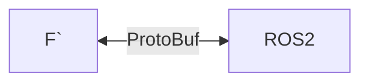
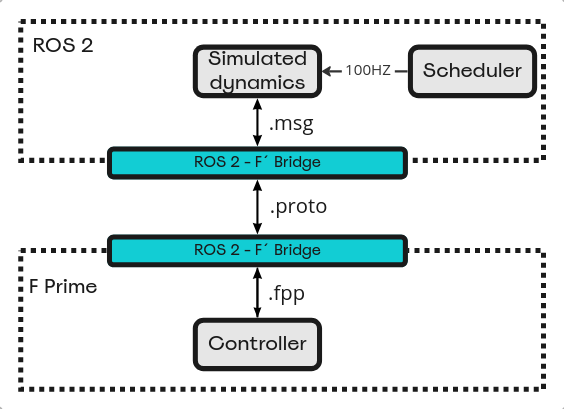
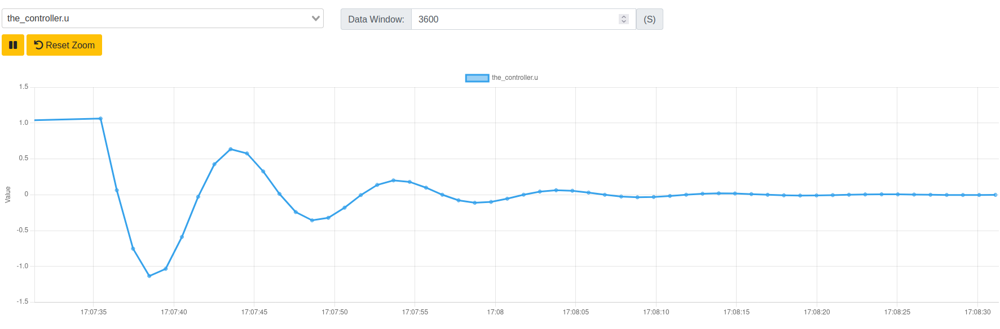
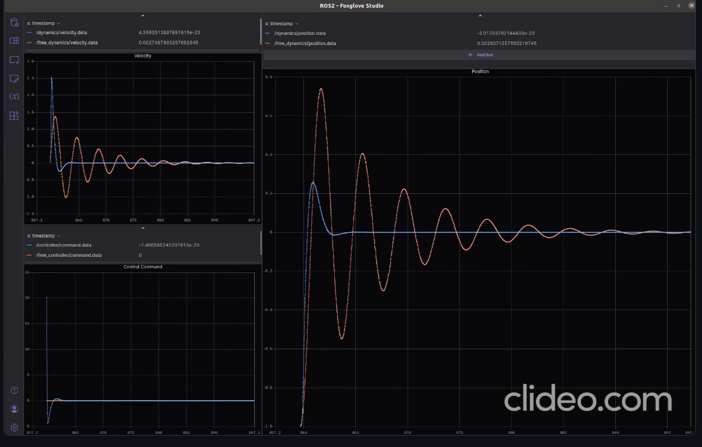

# ROS2-FPrime Bridge - by Lulav Space 

This repository provides a simple and convenient way to bridge the gap between FPrime and ROS2 when such integration is required, by using [ProtoBuf]((https://developers.google.com/protocol-buffers)) messages as an intermediary between the two frameworks. This solution enables a complete decoupling between the two frameworks, and actually can be used to integrate FPrime or ROS2 with any other framework.



# Table of Contents
- [How it works](#how-it-works)
- [The spring example](#the-spring-example)
  - [Prerequisites](#prerequisites)
  - [Install](#install)
  - [Run with `docker-compose`](#run-with-docker-compose)
    - [Monitoring](#monitoring)
  - [Develop with `devcontainer`](#develop-with-devcontainer)
    - [Run (terminal):](#run-terminal)
    - [Run (VSCode Tasks):](#run-vscode-tasks)
      - [Monitoring](#monitoring-1)

# How it works

The user needs to define the messages going back and forth between the two frameworks by writing cpp [headers](examples/spring_mass_dumper/include/io_structs.hpp) that define the structures that make up the messages.

The cpp headers are used as the source by which all communication messages are defined for all interface description languages. A python [script](common/autogen/compile.py) parses the headers, and generates schema files for:
- FPrime (`.fpp`)
- ROS (`.msg`)
- Protobuf (`.proto`, version 2 and 3)

For further details of the usage of the python script see the dedicated [README](common/autogen/README.md).

The user needs to define an FPrime component and a ROS node that will act as the two ends of the bridge. Communication between the FPrime component and the ROS node is performed via either UDP or named pipes (FIFO), for which simple wrapper classes are provided. Alternatively, you may choose any other relevant protocol.

ProtoBuf serialization + deserialization takes (much) less than 100 microseconds (even for large messages with dozens of fields). On each end of the bridge, message fields are “translated” seriatim between Protobuf and ROS/FPrime. The python script also provides automatic code generation for the translator functions (currently FPrime-ProtoBuf only).  

# The spring example
The repository also provides an example project called `spring_mass_dumper`, which, as the name suggests, is a simple example of a spring mass dumper, in which the spring controller implementation resides inside an FPrime component, and the simulation that drives it resides inside a ROS2 node. This example may be used as a boilerplate for your project, since the basic functionality will likely stay the same, the only changes being the specific messages between ROS2 and FPrime.

The project provides a header file named [io_structs.hpp](examples/spring_mass_dumper/include/io_structs.hpp) in which the messages between the simulation and controller are defined, and which is used as the input for the python script.

This example uses UDP as the underlying communication protocol and creates a two way channel (each side has a client and a server). A simple ROS node ("scheduler") drives the entire system at 100Hz. 

Further details about the internal implementation of the spring project (which may be compiled as a stand-alone project) can be found in its [README](examples/spring_mass_dumper/README.md) file. 



## Prerequisites 
since everything is run inside a Docker container, the only two prerequisites are:
- [Visual Studio Code](https://code.visualstudio.com/download)
- [Docker](https://www.docker.com/)

## Install
                
    git clone https://github.com/lulav/ros2_fprime_bridge.git

then Open the repository in VScode:

    cd ~/ros2_fprime_bridge
    code .

## Run with `docker-compose`
This repository provides both a [dockerfile](Dockerfile) that runs a stand-alone docker image on your host machine, and a Dev-Container [dockerfile](.devcontainer/Dockerfile) for in-docker development (next section).

To run the docker image, first make sure that within Visual Studio Code, you've opened the working directory **locally** (not inside a Dev-Container). Then, simply run:

    docker-compose up

### Monitoring

At this point, you can open `127.0.0.1:5000` in your favorite browser and see the GDS GUI running. If you open the charts tab and choose `the_controller.u` from the dropdown menu, you should see something similar to the following telemetry:



In addition, if you open a ROS2 viewer, e.g. [Foxglove](https://foxglove.dev/download), you should also see a similar visualization:



In order to view the simulation signals in Foxglove's Studio:

1. Open Foxglove's Studio.
2. Data source --> Open connection --> Rosbridge (ROS 1 &2) --> set the WebSocket URL as ws://localhost:9090.
3. Add panels to see the signals (Plot or Raw message). The signals are:

        position - /state.r
        velocity - /state.v
        control signal - /control_signal.u

## Develop with `devcontainer`
Before you begin, make sure that within Visual Studio Code, you've opened the working directory inside a [Dev-Container](https://code.visualstudio.com/docs/devcontainers/containers) by choosing the `Reopen in Container` option.

**The [build.sh](.devcontainer/build.sh) script should build automatically the following after the `devcontainer` image is built:**

1. schema files and ProtoBuf code:
```bash
        cd common/autogen
        chmod +x compile.py
        ./compile.py spring_defs.json
        protoc -I=schemas/spring/proto3 --cpp_out=./schemas/spring/proto3 spring.proto
```

**Note**: the protoc compiler actually runs automatically as part of the build process in the spring example (both on the FPrime and ROS2 builds). See the `CMakeLists.txt` files of the bridge component/node.

2. ROS2 project:
```bash
        cd ros_ws
        source install/local_setup.bash
        colcon build
```

3. FPrime project:
```bash
        cd fprime_ws/spring
        fprime-utils generate
        fprime-utils build
```

### Run (terminal):

        ros2 launch scheduler simulator.launch.py

### Run (VSCode Tasks):

We set useful [VSCode Tasks](.vscode/tasks.json) for this project:

1. Run default simulation.
2. Build ROS workspace.
3. Build Fprime project.

The spring example can be launch from `launch-simulation` task.

#### Monitoring

At this point, if you open the charts tab in the GDS GUI and choose `the_controller.u` from the dropdown menu, you should see telemetry as in the previous section.

In addition, if you open [Foxglove](https://foxglove.dev/download) (see details in the previous section), you should also see a  visualization as in the previous section.